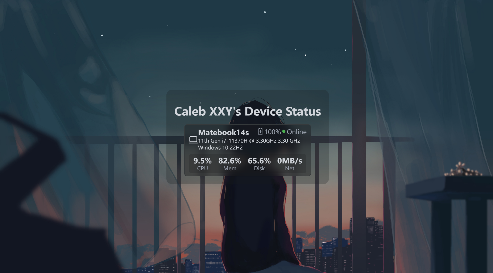
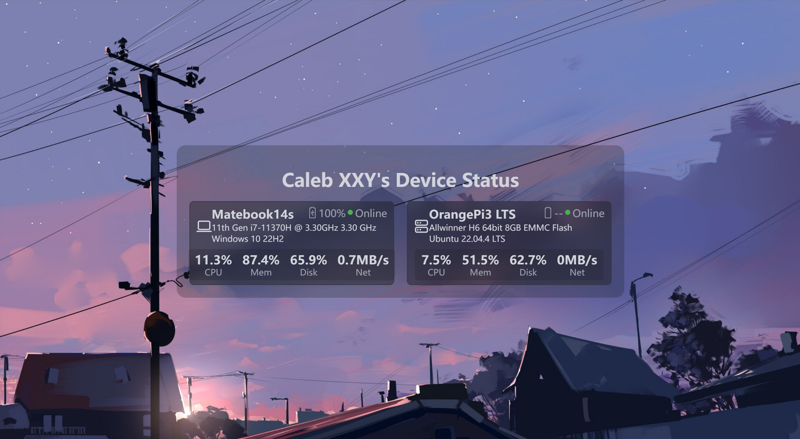
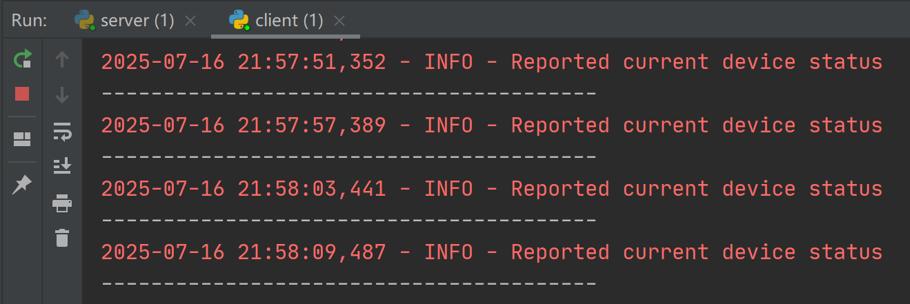

# Device Status

An elegant web page that displays your devices' status

[Docs](http://docs.xuxiny.top/device-status/)

## 📷 ScreenShots







## 🚀 Features

- [x] support for displaying CPU, memory, disk, and network usage
- [x] Support for displaying device battery, whether it is charging, and online status
- [x] Customizable theme, background image, refresh_interval, offline_interval
- [x] Support for Docker deployment
- [ ] Alert function (CPU, Mem>--%, device offline)
- [ ] Display temperature information

## 🔨 Usage

First install requirements
```
pip install -r requirements.txt
```

Modify the configuration file for your server. ( `server/config.ini`)

Run `server/server.py` on your server

Configure `client/config.ini` & run `client/client.py` on your devices respectively